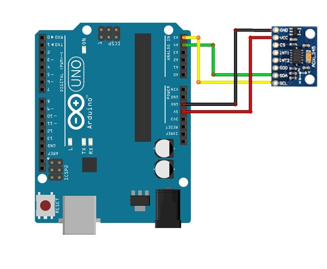
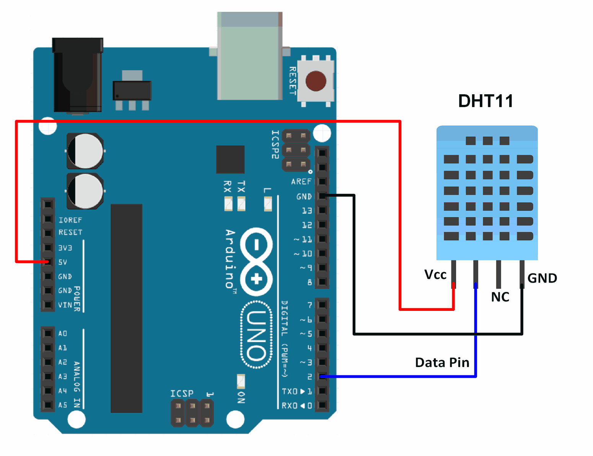

# Structural Health Monitoring System (Arduino) — Report & Wiring

A concise repository for an Arduino‑based **Structural Health Monitoring System (SHMS)** using an **ADXL345 accelerometer** and **DHT11 temperature/humidity** sensor. This repo is docs‑first: it hosts the final report, a wiring gallery, and slides.

> 📄 **Report (preferred PDF):** `report/structural-health-monitoring-system.pdf`  
>    **or (if you keep DOCX):** `report/project-report-b9.docx`  
> 🖼️ **Figures:** see the wiring gallery below  
> 🖥️ **Slides:** `slides/shms-presentation-b9.pptx`

---

## Overview
- **Goal**: capture vibration & environment data and outline a simple SHM pipeline.  
- **Hardware**: Arduino Uno R3, ADXL345 (I²C), DHT11, breadboard, jumper wires.  
- **Data**: time‑stamped acceleration and temp/humidity samples suitable for offline analysis.  
- **Status**: documentation + diagrams; code/firmware can be added later under `firmware/`.

---

## Bill of Materials (BOM)
- 1× Arduino Uno R3 (5V)  
- 1× ADXL345 accelerometer breakout (I²C capable)  
- 1× DHT11 temperature/humidity sensor  
- Breadboard + male–male jumper wires

---

## Wiring (quick map)

**ADXL345 → Arduino Uno (I²C)**  
- `VCC` → `5V` *(most breakout boards are 3.3–5V tolerant; check your board)*  
- `GND` → `GND`  
- `SDA` → `A4`  
- `SCL` → `A5`  

**DHT11 → Arduino Uno**  
- `VCC` → `5V`  
- `DATA` → `D2`  
- `GND` → `GND`  

---

## Figure Gallery

<p align="center">
  
  
</p>

---

## Repository Structure
```
structural-health-monitoring-system-arduino/
├─ report/
│  ├─ structural-health-monitoring-system.pdf   # preferred (export from DOCX)
│  └─ project-report-b9.docx                    # optional original
├─ images/
│  ├─ arduino-uno-adxl345-wiring.jpg
│  └─ arduino-uno-dht11-wiring.png
├─ slides/
│  └─ shms-presentation-b9.pptx                 # pptx only is fine
└─ README.md
```

---

## Suggested Data Format (if you log later)
**CSV**
```csv
timestamp,ax,ay,az,temperature,humidity
2025-01-01T10:00:00.000Z,0.01,0.02,-0.98,27.1,62.5
```

---

## About (fill on GitHub → About → ✎)
**Description (≤160 chars):**  
Arduino‑based Structural Health Monitoring System. Final report, wiring diagrams (ADXL345 + DHT11), and presentation slides.

**Topics:**  
`structural-health-monitoring`, `shm`, `arduino`, `adxl345`, `dht11`, `i2c`, `vibration`, `sensors`, `report`, `slides`

---

## License
Add a `LICENSE` file (e.g., **CC BY‑NC 4.0** for docs; **MIT** if you later add code).
